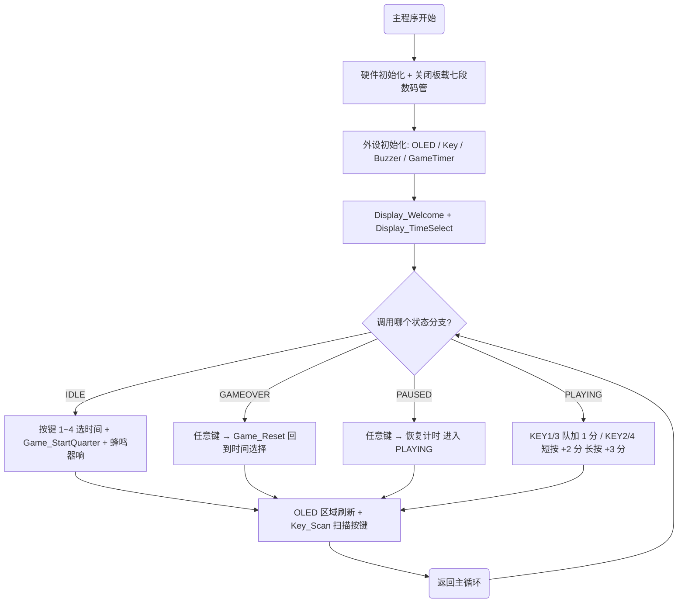
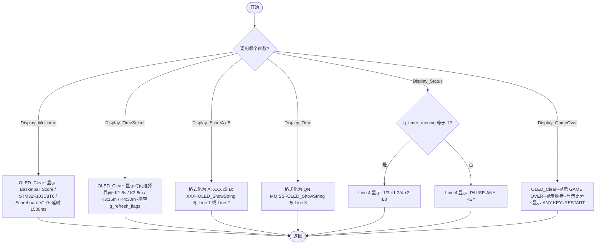
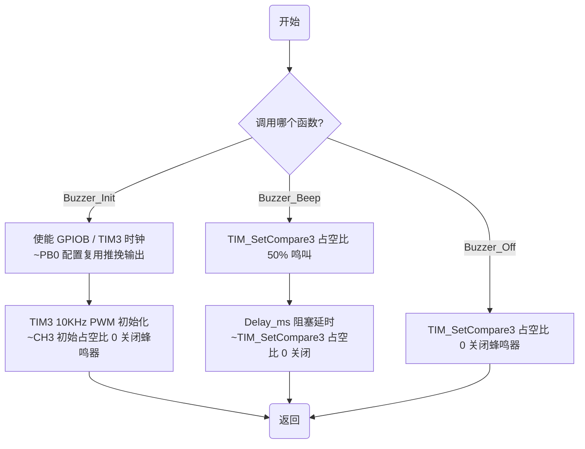
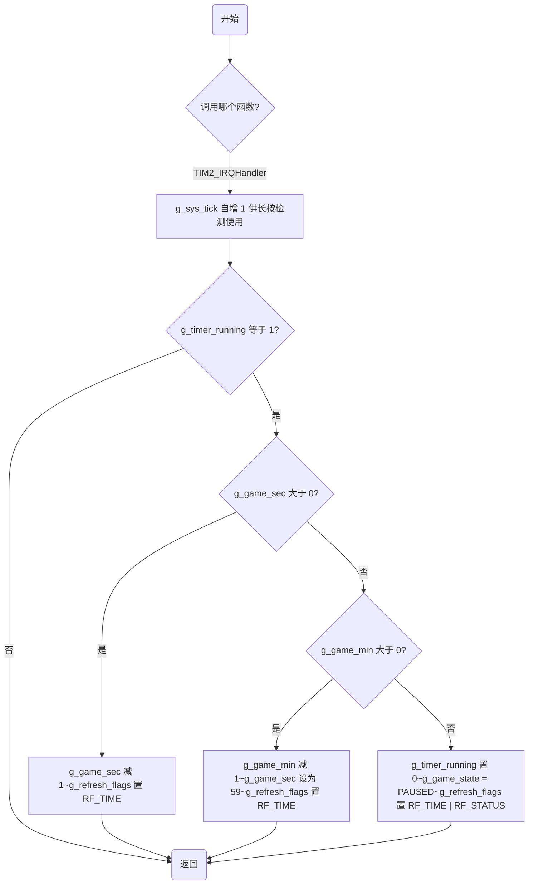

# 篮球比赛记分牌 - 程序流程图

> 规范: 开始/结束用 `([文字])`、判断用 `{文字}`、操作用 `[文字]`、`flowchart` 顶格。
> `Z([返回])` 为函数出口，`while(1)` 死循环无结束节点。

---

## 模块列表

| 编号 | 模块名称 | 文件 | 包含函数 |
|------|----------|------|----------|
| 1 | 主程序模块 | main.c | `main()`, `GameTimer_Init()` |
| 2 | OLED 显示模块 | main.c | `Display_*()` 系列函数 |
| 3 | 按键模块 | Key.c | `Key_Init()`, `Key_Scan()`, `Key_IsPressed()` |
| 4 | 蜂鸣器模块 | Buzzer.c | `Buzzer_Init()`, `Buzzer_Beep()`, `Buzzer_Off()` |
| 5 | 定时器中断模块 | stm32f10x_it.c | `TIM2_IRQHandler()` |

---

## 图 1 - 主程序流程图

---

## 图 2 - 显示模块流程图

---

## 图 3 - 蜂鸣器模块流程图

---

## 图 4 - 按键模块流程图

```mermaid
flowchart TD
    A([开始]) --> B{调用哪个函数?}
    B -->|"Key_Init"| C["使能 GPIOA / AFIO 时钟~PA12~PA15 配置上拉输入~GPIO_PinRemapConfig 禁用 JTAG 和 SWD"]
    C --> Z
    B -->|"Key_Scan"| D["遍历 KEY1~KEY4~检查 key_released 标志与引脚电平"]
    D --> E{"key_released 等于 0~且引脚回到高电平?"}
    E -->|是| F["重置 key_released = 1 允许再次触发"]
    F --> H["继续扫描下一键"]
    E -->|否| G{"引脚低电平 且 key_released = 1?"}
    G -->|是| I["Delay_ms 20ms 消抖~二次确认低电平~key_released 置 0~return KEY_PRESS"]
    G -->|否| J["无有效按键~return KEY_NONE"]
    I --> Z
    J --> Z
    H --> Z
    B -->|"Key_IsPressed"| K["根据 key_num 参数~GPIO_ReadInputDataBit 读取原始电平~返回 1(按下) 或 0(松开)"]
    K --> Z
    Z([返回])
```

---

## 图 5 - 定时器中断模块流程图

---

## 图清单

| 编号 | 流程图名称 | 节点数 | 说明 |
|------|-----------|--------|------|
| 1 | 主程序流程图 | 11 节点 | 初始化 + 状态机分支调度 |
| 2 | OLED 显示模块流程图 | 13 节点 | 6 个 Display_* 函数分支 |
| 3 | 蜂鸣器模块流程图 | 9 节点 | Init / Beep / Off 三函数分支 |
| 4 | 按键模块流程图 | 12 节点 | Init / Scan / IsPressed 三函数分支 |
| 5 | 定时器中断模块流程图 | 10 节点 | 1ms 计时 + 倒计时 + 暂停切换 |
