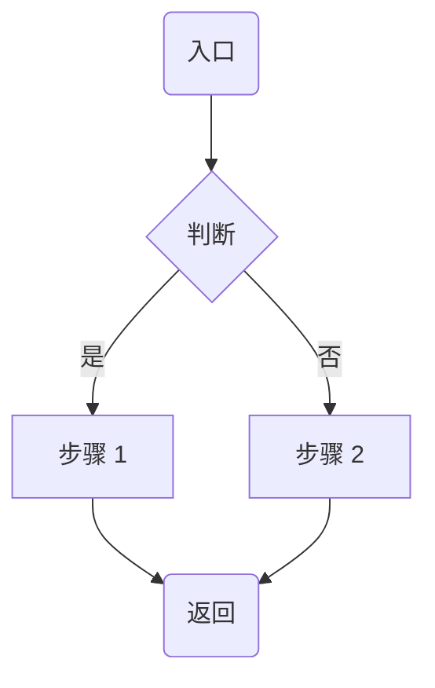
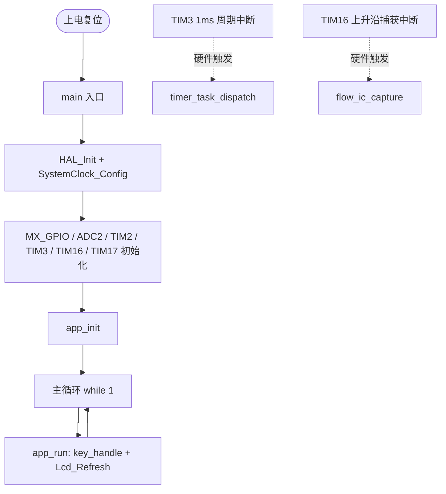
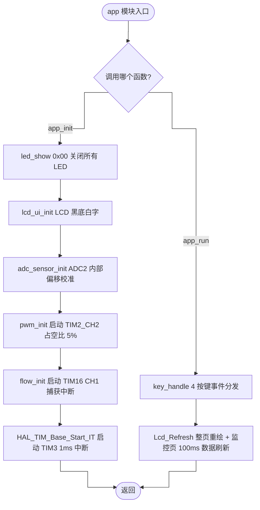
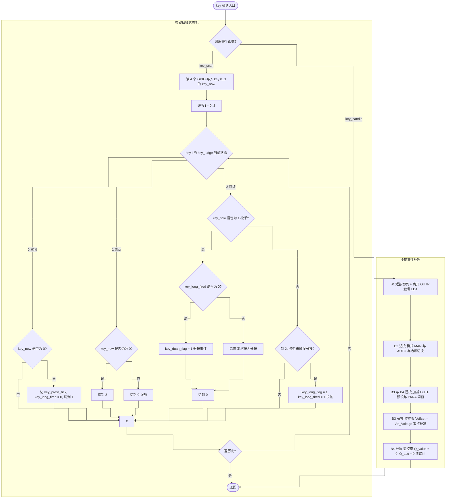
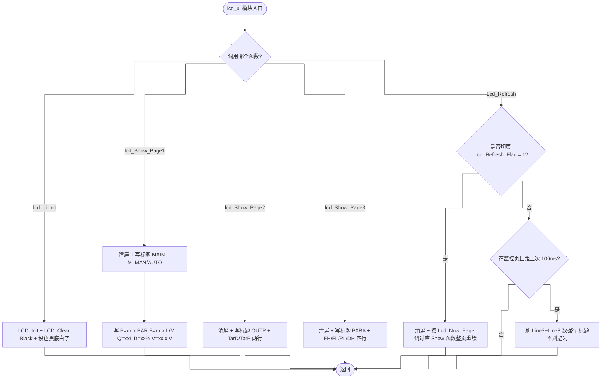
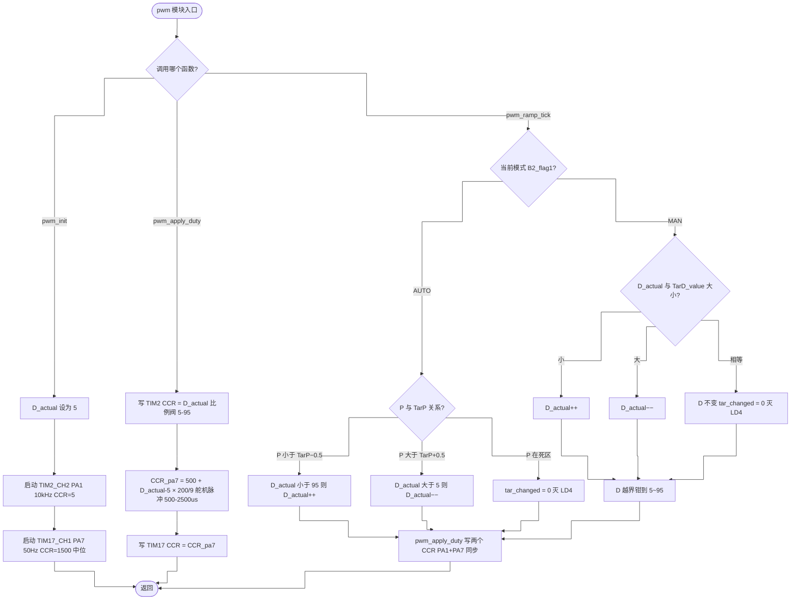
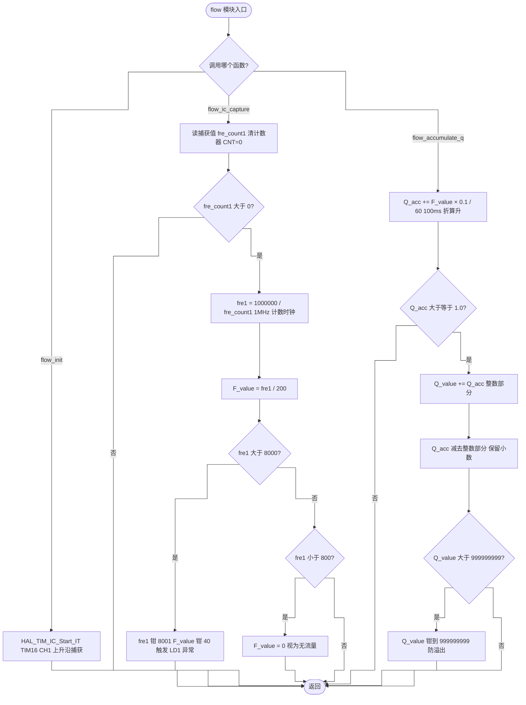
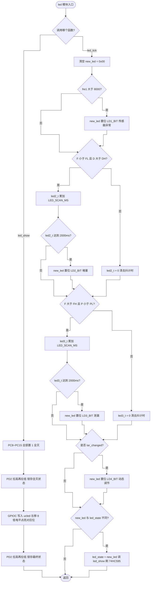
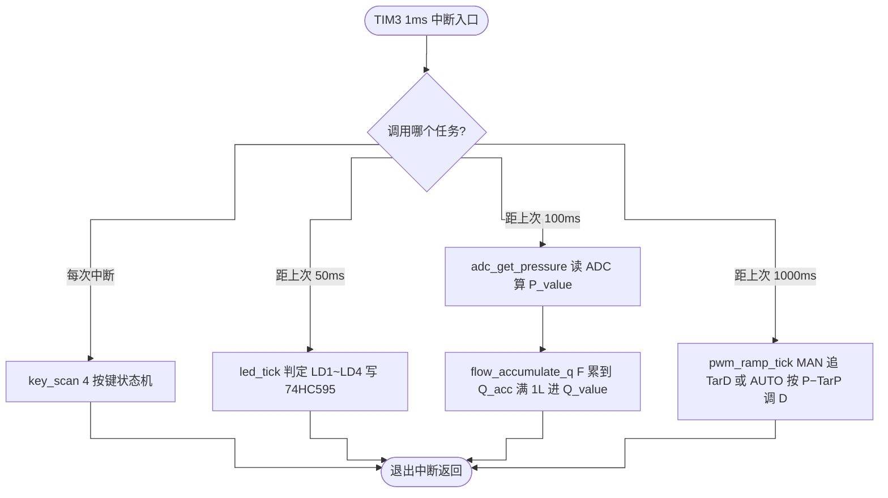

# STM32G4 压力流量监控系统 —— 程序流程图

> 每张图一个流程图。开头 `{调用哪个函数?}` 分支，每个函数一支，汇合到 Z([返回]) 出口。
> 中文描述，函数名/变量名/常量保持英文。判断框用 是/否。循环回到最小编号入口。

## draw.io 渲染避坑规则（必读）

draw.io 内置的是 **Mermaid v10.5.0 精简版**，比 mermaid.live 严格得多。**测试发现 8 个流程图里 adc_sensor 一个画布空白、其他 7 个正常画出来**，根因只有一个：

**节点文本里出现 `*` 这个字符且未加双引号，draw.io 解析器直接当 token 报错，画布空白。**

排查对照表（按炸的概率排序）：

| 排名 | 雷区 | 炸的方式 | 修复 |
|---|---|---|---|
| 1 | `[...]` 文本里出现裸 `*` | **100% 报语法错**（实测元凶） | 节点加双引号：`A["Vin = adc * 3.3 / 4096"]` |
| 2 | `%%{init: {...}}%%` 头 | 解析器跳过此行，画布仍能出 | 可删；想保留也没事（推荐删） |
| 3 | `([椭圆])` 语法 | 部分 10.5.0 解析失败 | 改成 `("圆角矩形")` |
| 4 | `{判断框文本}` 含 `?` 或中文 | 不报错但中文可能乱 | 改成 `{"判断框文本"}`（去问号 + 加引号） |
| 5 | `linkStyle default curve:step` | 被忽略，不报错 | 删 |
| 6 | `classDef` / `class` | 被忽略，不报错 | 删 |
| 7 | ID 含空格（如 `A Node`） | 报 panic | 改 `ANode` |
| 8 | 中文节点未加引号 | UTF-8 tokenization 失败 | 全部加双引号：`A["中文"]` |

**最稳的写法模板：**



> 规则：**所有含中文、空格、`*`/`?`/特殊符号的节点，都用双引号包起来**。

---

## 模块列表

| # | 模块 | 包含函数 | 职责 |
|---|---|---|---|
| 1 | **app** | `app_init()` / `app_run()` | 初始化 LCD/ADC/PWM/Flow + 主循环调度 |
| 2 | **key** | `key_scan()` / `key_handle()` | 按键状态机 + 长短按事件分发 |
| 3 | **lcd_ui** | `lcd_ui_init()` / `lcd_Show_Page1~3()` / `Lcd_Refresh()` | 三页 LCD 显示与 100ms 周期刷新 |
| 4 | **adc_sensor** | `adc_sensor_init()` / `adc_get_voltage()` / `adc_get_pressure()` | ADC 采样 + 电压 → 压力映射 + Voffset |
| 5 | **pwm** | `pwm_init()` / `pwm_apply_duty()` / `pwm_ramp_tick()` | PA1 TIM2_CH2 + PA7 TIM17_CH1 同步 + 1%/s 斜坡 + MAN/AUTO 算法 |
| 6 | **flow** | `flow_init()` / `flow_ic_capture()` / `flow_accumulate_q()` | TIM16 测频 + 瞬时流量 + Q 累计 |
| 7 | **led** | `led_show()` / `led_tick()` | 74HC595 驱动 + LD1~LD4 状态判定 + 2s 去抖 |
| 8 | **timer_task** | `timer_task_dispatch()` | TIM3 中断里 50/100/1000ms 三档周期分派 |

> 注：`settings` 模块仅含全局变量声明（无函数），不画流程图。

---

## 0. 主程序流程图（main.c）



---

## 1. app 模块



---

## 2. key 模块



---

## 3. lcd_ui 模块



---

## 4. adc_sensor 模块

```mermaid
%%{init: {"flowchart": {"curve": "step"}}}%%
flowchart TD
    A([adc_sensor 模块入口]) --> B{调用哪个函数?}
    B -->|adc_sensor_init| C[HAL_ADCEx_Calibration_Start ADC2 单端校准]
    C --> Z([返回])
    B -->|adc_get_voltage| D[HAL_ADC_Start 触发 ADC2 转换]
    D --> E[HAL_ADC_PollForConversion 等待 10ms 超时保护]
    E --> F{转换成功?}
    F -->|是| G[adc_value2 = HAL_ADC_GetValue]
    F -->|否| H[跳过 保留上次 adc_value2]
    G --> I[Vin_Voltage = adc_value2 * 3.3 / 4096]
    H --> I
    I --> Z
    B -->|adc_get_pressure| J[v = adc_get_voltage 取电压]
    J --> K{v 是否小于等于 Voffset?}
    K -->|是| L[P_value = 0]
    K -->|否| M[range = 3.3 - Voffset, 最小 0.01 防除零]
    M --> N[P_value = (v - Voffset) * 10 / range, 钳到 10.0]
    L --> Z
    N --> Z
```

---

## 5. pwm 模块



---

## 6. flow 模块



---

## 7. led 模块



---

## 8. timer_task 模块


